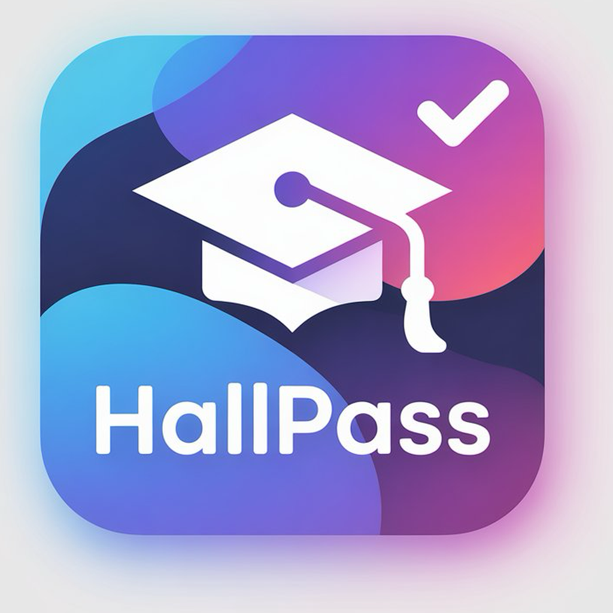

# HallPass

<p align="center">
  
</p>

<p align="center">
  <strong>Empowering School Communication</strong>
</p>

<p align="center">
  A modern iOS app that bridges the gap between teachers, parents, and administrators for seamless school communication.
</p>

<p align="center">
  
  
  
  
</p>

---

## Features

### For Teachers
- **Classroom Management** - Create and manage classrooms with unique join codes
- **Student Roster** - Track students and their connected parents
- **Direct Messaging** - One-on-one communication with parents
- **Broadcast Messages** - Send announcements to all parents at once
- **Hall Pass System** - Digital hall passes with time tracking
- **Points & Rewards** - Gamified behavior tracking system
- **Class Stories** - Share classroom moments with photos

### For Parents
- **Real-time Notifications** - Stay informed about your child's school activities
- **Direct Communication** - Message teachers directly
- **Hall Pass Tracking** - See when your child leaves the classroom
- **Student Progress** - View points and achievements
- **Class Updates** - See class stories and announcements

### For Administrators
- **Dashboard Overview** - System-wide statistics at a glance
- **User Management** - Manage teachers, parents, and students
- **Classroom Oversight** - Monitor all classrooms
- **System Configuration** - App-wide settings

---

## Tech Stack

| Technology | Purpose |
|------------|---------|
| **SwiftUI** | Modern declarative UI framework |
| **Swift 5.9** | Primary programming language |
| **Supabase** | Backend-as-a-Service (Auth, Database, Realtime) |
| **PostgreSQL** | Database (via Supabase) |
| **Combine** | Reactive programming for state management |

---

## Architecture

```
TeacherLink/
├── Models/              # Data models (User, Classroom, Message, etc.)
├── Views/               # SwiftUI views organized by feature
│   ├── Admin/           # Admin dashboard views
│   ├── Auth/            # Login, signup, email confirmation
│   ├── Home/            # Teacher & parent dashboards
│   ├── Messages/        # Chat and messaging views
│   ├── HallPass/        # Hall pass management
│   ├── Points/          # Points and rewards system
│   └── Stories/         # Class stories feature
├── ViewModels/          # MVVM view models
├── Services/            # Backend services (Supabase integration)
└── Resources/           # Assets, colors, and configurations
```

---

## Getting Started

### Prerequisites

- Xcode 15.0 or later
- iOS 17.0+ device or simulator
- Supabase account (for backend)

### Installation

1. **Clone the repository**
   ```bash
   git clone https://github.com/DataDay-Technology-Solutions/mobile-apps.git
   cd mobile-apps/TeacherLink
   ```

2. **Open in Xcode**
   ```bash
   open TeacherLink.xcodeproj
   ```

3. **Configure Supabase** (if using real backend)

   Update `Services/SupabaseConfig.swift` with your Supabase credentials:
   ```swift
   static let supabaseURL = URL(string: "YOUR_SUPABASE_URL")!
   static let supabaseKey = "YOUR_SUPABASE_ANON_KEY"
   ```

4. **Run the app**
   - Select your target device/simulator
   - Press `Cmd + R` to build and run

### Demo Mode

The app includes a mock data mode for testing without a backend:

```swift
// In TeacherLinkApp.swift
let USE_MOCK_DATA = true  // Set to false for real Supabase
```

**Demo Credentials:**
| Role | Email | Password |
|------|-------|----------|
| Admin | admin@school.edu | admin123 |
| Teacher | teacher@school.edu | password |
| Parent | parent@school.edu | parent123 |

---

## Database Schema

### Core Tables

```sql
-- Users table
CREATE TABLE users (
    id UUID PRIMARY KEY DEFAULT uuid_generate_v4(),
    email TEXT UNIQUE NOT NULL,
    name TEXT NOT NULL,
    role TEXT NOT NULL CHECK (role IN ('admin', 'teacher', 'parent', 'student')),
    created_at TIMESTAMP WITH TIME ZONE DEFAULT NOW()
);

-- Classrooms table
CREATE TABLE classrooms (
    id UUID PRIMARY KEY DEFAULT uuid_generate_v4(),
    name TEXT NOT NULL,
    grade_level TEXT,
    class_code TEXT UNIQUE NOT NULL,
    teacher_id UUID REFERENCES users(id),
    created_at TIMESTAMP WITH TIME ZONE DEFAULT NOW()
);

-- Messages table
CREATE TABLE messages (
    id UUID PRIMARY KEY DEFAULT uuid_generate_v4(),
    conversation_id UUID NOT NULL,
    sender_id UUID REFERENCES users(id),
    content TEXT NOT NULL,
    is_read BOOLEAN DEFAULT FALSE,
    created_at TIMESTAMP WITH TIME ZONE DEFAULT NOW()
);

-- Conversations table
CREATE TABLE conversations (
    id UUID PRIMARY KEY DEFAULT uuid_generate_v4(),
    participant_ids UUID[] NOT NULL,
    class_id UUID REFERENCES classrooms(id),
    last_message TEXT,
    last_message_date TIMESTAMP WITH TIME ZONE,
    created_at TIMESTAMP WITH TIME ZONE DEFAULT NOW()
);
```

---

## Key Features Deep Dive

### Real-time Messaging
- Uses Supabase Realtime for instant message delivery
- Supports text messages and image attachments
- Read receipts and unread message counts
- Conversation threading by student context

### Hall Pass System
- Digital passes replace paper hall passes
- Automatic time tracking
- Teacher approval workflow
- Admin oversight and reporting

### Points & Rewards
- Customizable point categories
- Class-wide and individual rewards
- Leaderboards and achievements
- Parent visibility into student progress

---

## Contributing

1. Fork the repository
2. Create a feature branch (`git checkout -b feature/amazing-feature`)
3. Commit your changes (`git commit -m 'Add amazing feature'`)
4. Push to the branch (`git push origin feature/amazing-feature`)
5. Open a Pull Request

### Code Style

- Follow Swift API Design Guidelines
- Use SwiftUI best practices
- Maintain MVVM architecture
- Write meaningful commit messages

---

## Roadmap

- [ ] Push notifications
- [ ] Voice/video calling integration
- [ ] Multi-language support
- [ ] Android version
- [ ] Web dashboard for administrators
- [ ] Advanced analytics and reporting

---

## License

This project is proprietary software owned by DataDay Technology Solutions.

---

## Contact

**DataDay Technology Solutions**
- Website: [datadaytech.com](https://datadaytech.com)
- Email: support@datadaytech.com

---

<p align="center">
  Made with love for educators and families
</p>
